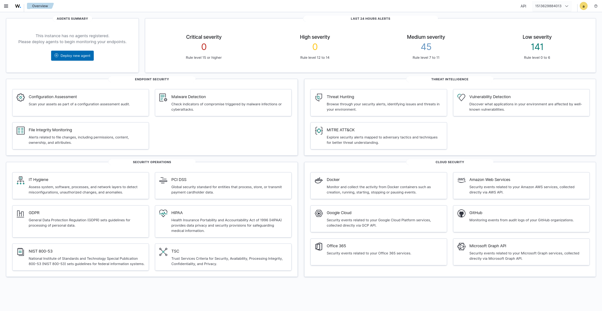
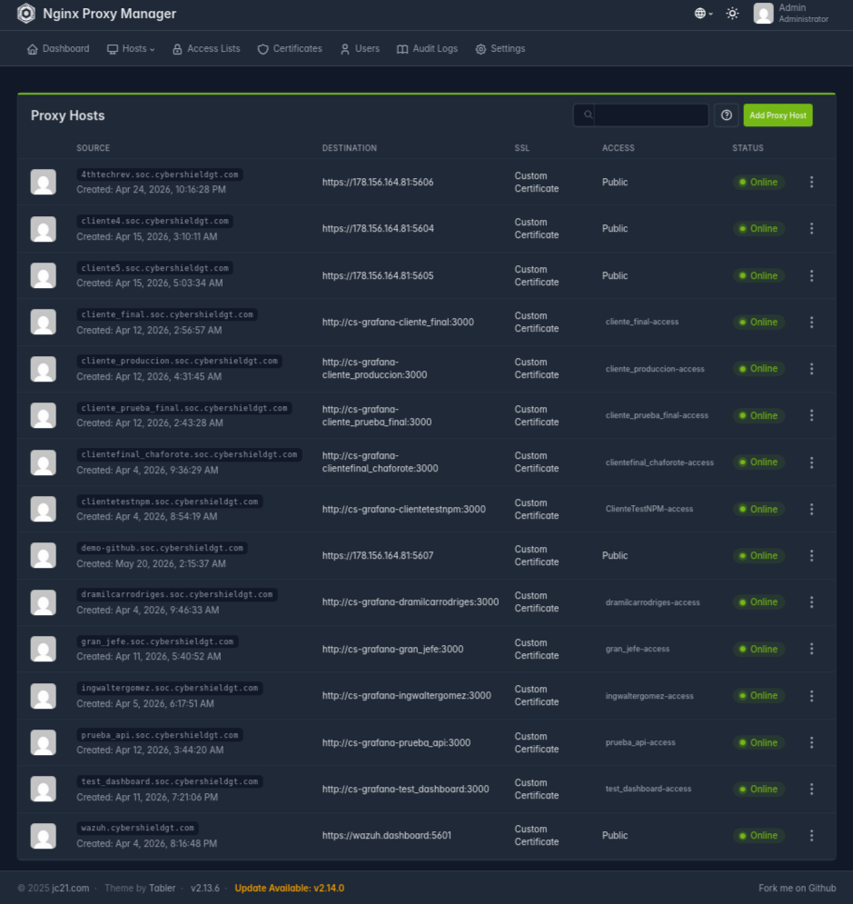
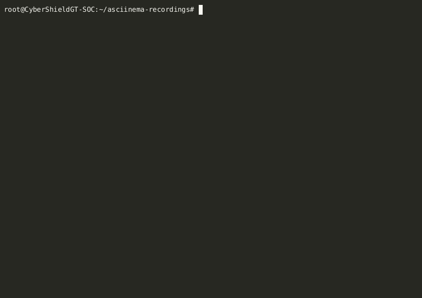

# 📸 Visual Documentation

## Complete Deployment Demo

### Automated Client Deployment - Full Process


**Complete automated deployment showing:**
- Script execution from start to finish
- Port detection and assignment
- Docker Compose orchestration
- SSL certificate generation
- NPM proxy configuration
- Credential generation
- Total time: **~3 minutes** ⚡

---

## Production Environment Screenshots

### Wazuh Dashboard - Active Security Monitoring


**Production dashboard showing:**
- Real-time security events
- Multi-client monitoring
- Active agents
- Security alerts and classification
- Event analytics and metrics

---

### Nginx Proxy Manager - SSL Automation


**Multi-client proxy configuration:**
- ingwaltergomez.soc.cybershieldgt.com
- cliente2.soc.cybershieldgt.com
- cliente3.soc.cybershieldgt.com
- cliente4.soc.cybershieldgt.com
- cliente5.soc.cybershieldgt.com

**Features:**
- Let's Encrypt wildcard certificate
- HTTPS forced on all domains
- HSTS enabled
- WebSocket support
- Automatic SSL renewal

---

### Docker Containers - Live System Status


**Container orchestration showing:**
- Multiple client stacks running concurrently
- Container health and status
- Port assignments per client
- Resource utilization
- System stability (multi-day uptimes)

**System capacity:**
- 5 active client deployments
- 15 containers total (3 per client: Manager, Indexer, Dashboard)
- Zero port conflicts
- Automatic resource management

---

## What This Demonstrates

### Technical Achievements

✅ **Zero-touch deployment** - Complete automation from command to production  
✅ **Multi-client isolation** - Dedicated stacks prevent cross-client interference  
✅ **Port management** - Automatic detection prevents conflicts  
✅ **SSL automation** - Let's Encrypt integration via NPM API  
✅ **Container orchestration** - Docker Compose lifecycle management  
✅ **Production stability** - Long container uptimes without intervention  
✅ **Resource efficiency** - 32GB server handling 5 concurrent clients  

### Operational Evidence

- **Concurrent deployments:** 5 clients running simultaneously
- **Fast provisioning:** 3-minute deployment time
- **Zero manual steps:** Script handles everything
- **Real security data:** Production monitoring active
- **Proven stability:** Multi-day container uptimes

---

## Technical Stack Visible

From the screenshots you can see:

- **Wazuh 4.14.4** - SIEM/EDR platform
- **Docker Compose** - Container orchestration
- **Nginx Proxy Manager** - Reverse proxy + SSL
- **Let's Encrypt** - SSL certificate automation
- **Debian 12** - Base operating system
- **Bash scripting** - Automation layer

---

## How to Reproduce

```bash
# Clone repository
git clone https://github.com/ingwaltergomez/cybershield-soc-automation.git
cd cybershield-soc-automation

# Configure credentials
cp scripts/lib/config.sh.example scripts/lib/config.sh
nano scripts/lib/config.sh

# Create client (watch it happen in ~3 minutes)
./scripts/crear-cliente.sh demo-client

# Access dashboard
https://demo-client.soc.cybershieldgt.com
```

---

## Deployment Metrics

| Metric | Value |
|--------|-------|
| **Deployment time** | 3 minutes |
| **Manual steps** | 0 |
| **Containers per client** | 3 (Manager, Indexer, Dashboard) |
| **Concurrent clients** | 5 active |
| **Port conflicts** | 0 |
| **SSL setup** | Automatic |
| **Uptime** | Multi-day stability |

All screenshots and recordings taken from production deployment on 32GB Hetzner VPS running Debian 12.
